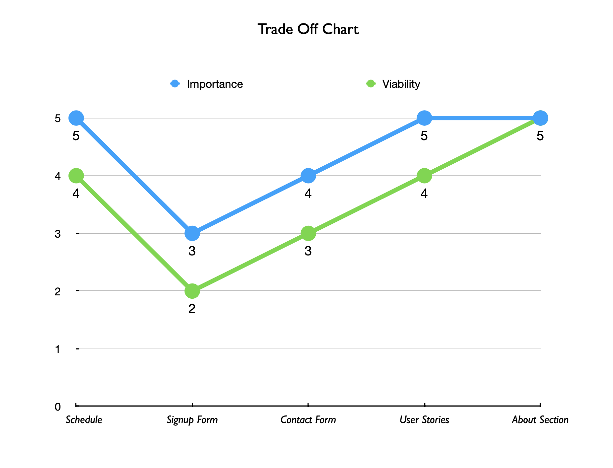
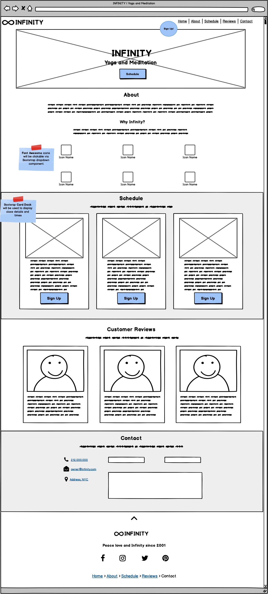
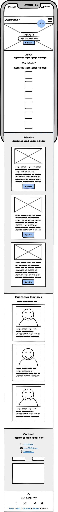
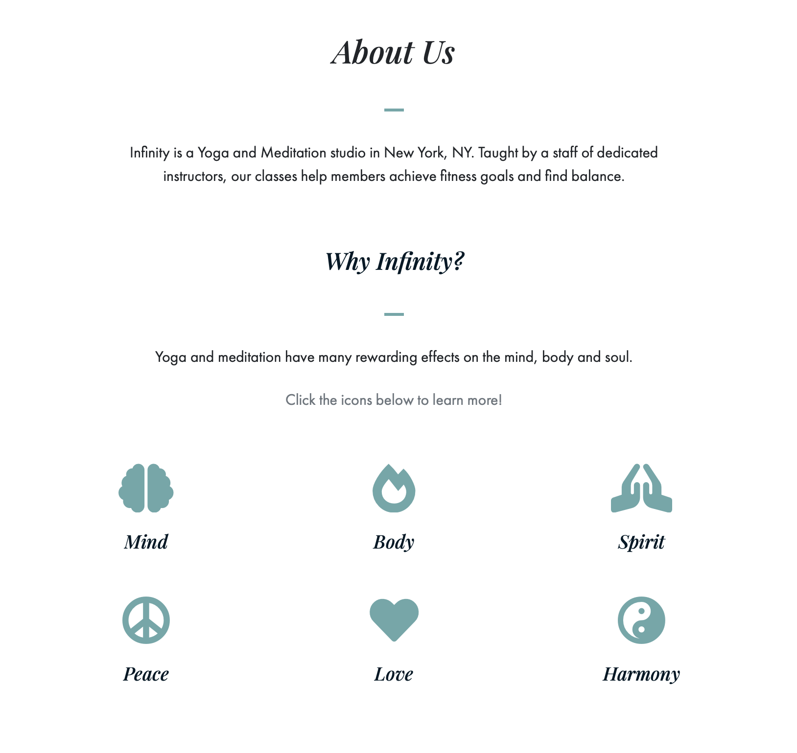
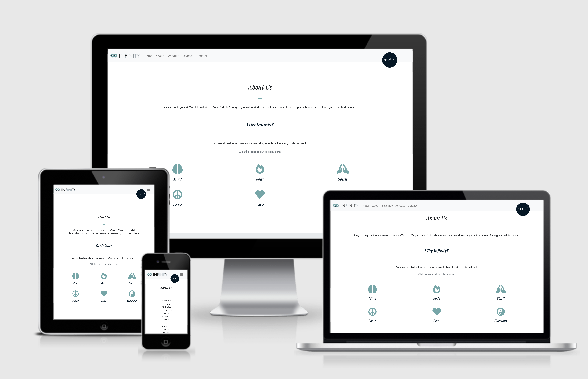
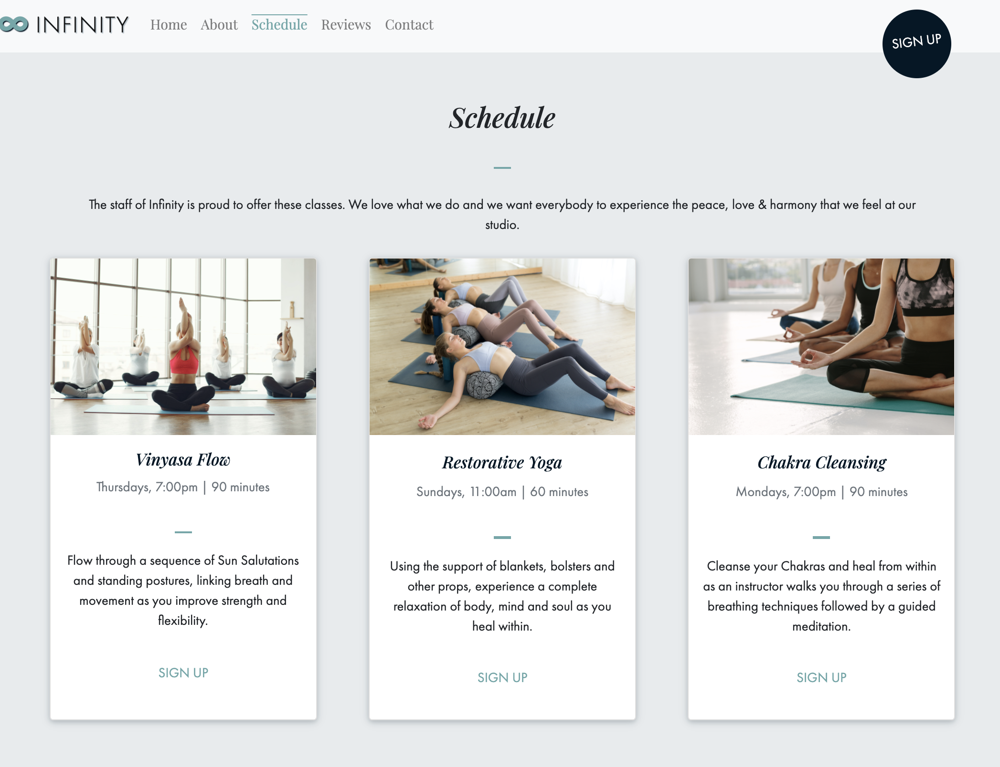
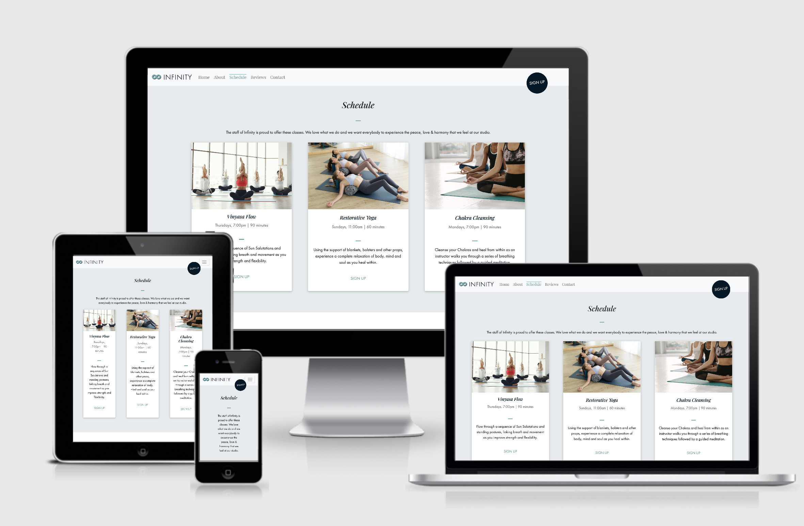
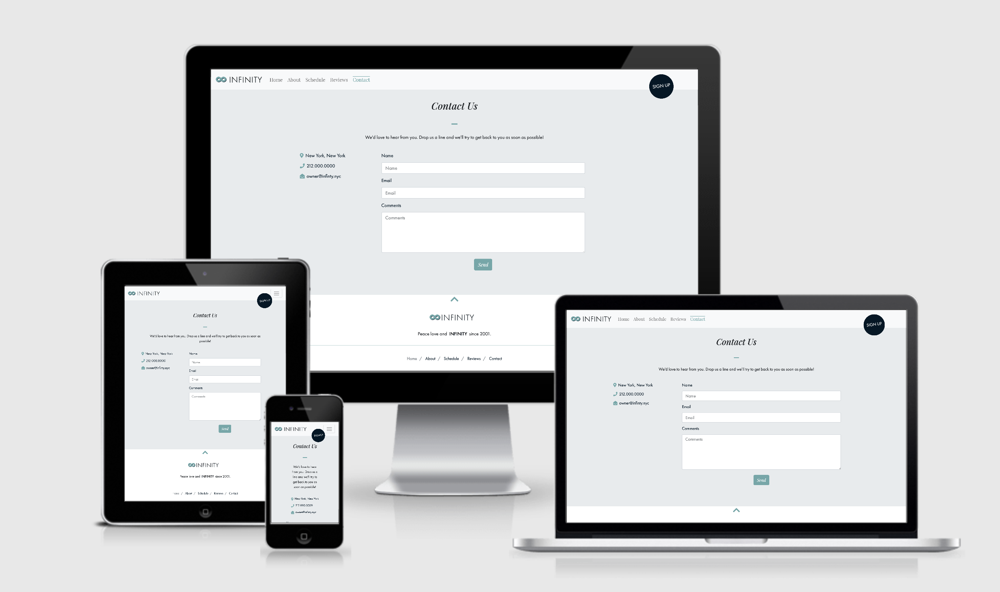
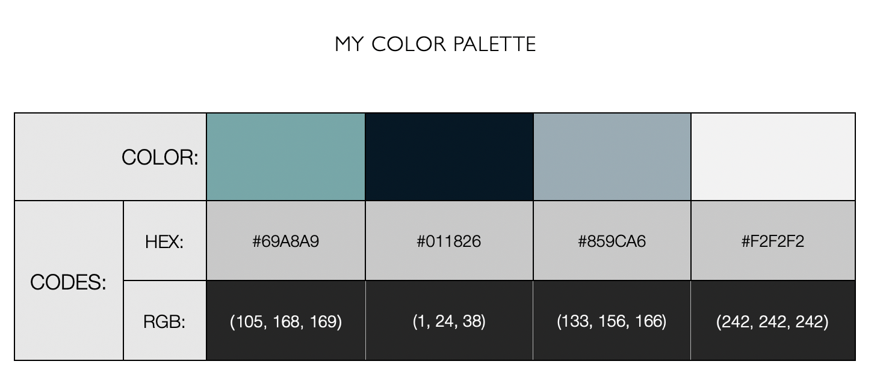
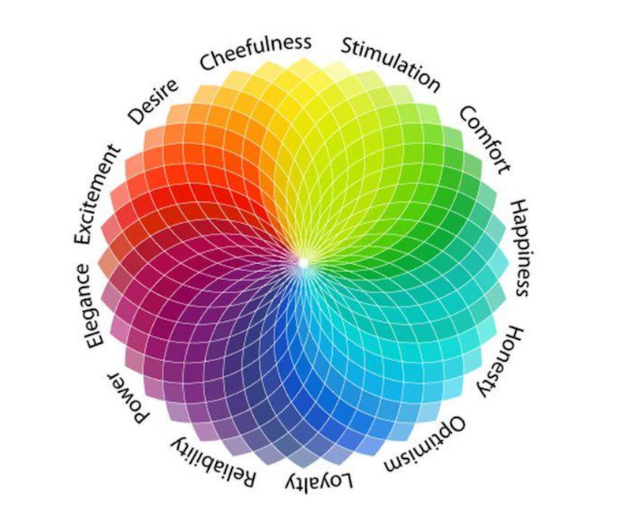

# Milestone 1

This responsive, user-friendly website was created for Infinity, a fictional yoga and meditation studio in New York, New York. As the Milestone 1 Project for [Code Institute's](https://codeinstitute.net) Full Stack Software Development Program, this website was built with HTML, CSS & Bootstrap.

Infinity’s website addresses all of the studio's goals in a clean, user-friendly and visually appealing manner. The website's Jumbotron includes a call-to-action button that directs users to the schedule section, where class details, times and a signup button can be accessed with ease. The website also includes an interactive, 'About' section, relatable 'Customer Reviews' and contact details.

## UX

The goal of Infinity's website is to attract new & existing members to the studio by providing class details and information about the studio and its procedures. The target market for Infinty is men & women (ages 24-36) who live in New York, NY and currently practice or wish to begin practicing yoga and meditation.

The final version of this website allows Infinity to achieve its' goals for the following reasons:

* The website provides a call-to-action button with a link in the Jumbotron (above the fold).

* The website provides class details and class times in one central location.

* The website provides information about the studio and its' procedures.

* Infinity's website is responsive.

* The website navigation is intuitive.

Customer Reviews were created by the [developer](https://www.github.com/alissatroiano) during the planning phase of this project and were used to help guide the wireframing process:

> As a potential studio member, I want the ‘About’ section to provide meaningful information so I can decide if it's the right place for me to sign up.
>>
> As a prospective Infinity member, I want to be able to contact the studio directly so I can inquire about new memberships.  
>>
> As a potential Infinity member, I want to be able to view the website from my mobile device so I can check it out while I'm on the go.
>>
> As an Infinity member, I can view the class schedule so I can plan my yoga & meditation routine accordingly.
>>
> As a studio member, I can read about all of Infinity's classes so I can decide if I want to try something new.
>>
> As an Infinity member, I can view the studio's contact information so I can inquire about my membership or any other issues.

In order to determine what features were the most important and most viable, the following Strategy Plane activity was completed during the planning phase of this project.

A full write-up of the strategy planning conducted for this project can also be viewed [here](wireframes//ms1planning.pdf). To only view charts and tables, checkout [this document](wireframes//strategyplane.pdf).

Once the strategy exercises were completed, the following low-fidelity wireframes were created by the [developer](https://www.github.com/alissatroiano).

* [Desktop Wireframe](wireframes//desktopwireframe.png)

* [Tablet Wireframe](wireframes//tabletwireframe.png)

* [Mobile Wireframe](wireframes//mobilewireframe.png)

After starting the project and getting a better feel for the desired outcome, the developer made a second round of more detailed, high-fidelity wireframes.

These wireframes guided the remainder of the development process.

All wireframes were created with [Balsamiq](https://balsamiq.com/) wireframing software and can be viewed entirely in [this document](wireframes//allwireframes.pdf).

## Features

* About:

The about section allows users to learn about yoga and meditation in a fun and interactive fashion, by providing a paragraph of content and clickable icons.

*You can view the About section [here](https://alissatroiano.github.io/MS-1/#about).*

* Schedule:

The Schedule section provides site visitors with class information and a place to sign up by listing class times, durations, details and a, "Sign Up," button.

*You can view the Schedule [here](https://alissatroiano.github.io/MS-1/#schedule)*

* Customer Reviews:

The user stories section allow users to learn more about Infinity from trustworthy sources, by reading quotes from existing Infinity members.

*You can view the Customer Reviews section [here](https://alissatroiano.github.io/MS-1/#reviews).*

* Contact Form:

The contact form allows site visitors to contact the studio by filling out a form and inputting their name, email and comments.

*You can view the Contact Form [here](https://alissatroiano.github.io/MS-1/#contact).*

### Existing Features

* Schedule
* About
* Customer Reviews
* Contact Form

### UX Design

#### Typography

The fonts selected for Infinity's website were:

1. Playfair Display, serif
2. Futura PT, sans-serif

The developer selected these fonts because:

* When it comes to typography, serif and sans-serif fonts pair together nicely, creating a modern and clean aesthetic that will appear to the project's target market.

* Playfair Display: A serif font that brings both style & elegance to the project.

* Futura-PT: is a modern, sans-serif font that is clean, visually appealing and easy for users to read.

#### Color Scheme

The following color scheme was chosen by [the developer](https://www.github.com/alissatroiano).

The developer chose this color palette after much research and consideration.

**The primary color is a mix of blue and green, which are both associated with positive, calm emotions, like comfort and happiness, according to UXD Research from the following sources:**

* [Toptal.com's article, 'Color in UX'](https://www.toptal.com/designers/ux/color-in-ux) .

* **The dark blue (#081126) in the color palette was chosen because:**

* It compliments the primary color very well.

* Classic blue was chosen as the [Pantone](https://www.pantone.com/color-intelligence/color-of-the-year/color-of-the-year-2020-tools-for-designers) color of the year for 2020.

## Technologies Used

This project makes use of the following languages, frameworks and libraries:

* [HTML](https://html5tutorial.info)

* [CSS](https://www.w3.org/Style/CSS/Overview.en.html)

* [Bootstrap](https://getbootstrap.com)

* [GitHub/GitHub Pages](https://github.com/)

* [Git](https://git-scm.com/)

* [GitPod](https://gitpod.io/)

* [Animate On Scroll](https://michalsnik.github.io/aos/)

* [CSS Autoprefixer](https://autoprefixer.github.io)

* [W3C Jigsaw Validator](https://jigsaw.w3.org/css-validator/)

* [W3C HTML Validator](https://validator.w3.org/)

* [Popper.js](https://popper.js.org/)

* [jQuery](https://jquery.com/)

* [Balsamiq](https://balsamiq.com/)

## Testing

The following tests have been conducted by the [developer](https://www.github.com/alissatroiano). Each test described below was accompanied by the actions taken to ensure the tests passed. ***A full write-up of the testing process can also be reviewed [here](TESTING.md).***

1. Navigation:
    1. Visited navigation bar in website.
    2. Clicked each link.
    3. Verified links bring user to proper section.
    4. Repeated steps 1-3 on mobile and tablet.

2. Contact Form:
    1. Visited contact section of website.
    2. Filled out contact form with text.
    3. Tried to submit contact form with `required` field blank.
    4. Failed to fill out "email" without email address.
    5. Repeated steps 1-4 on mobile and tablet.

3. W3C Jigsaw CSS Test:
    1. Visited [W3C HTML Validator](https://validator.w3.org/nu/#textarea).
    2. Uploaded entire stylesheet.
    3. Made all changes.
    4. Ran test again to verify all CSS passed.
    5. Repeated steps 1-4 again after repairing styles.

4. W3C HTML Test:
    1. Visited [W3C HTML Validator](https://validator.w3.org/nu/#textarea).
    2. Pasted all contents of `index.html`.
    3. Made all corrections to repair errors.
    4. Ran test again to verify all HTML passed tests.
    5. Repeated steps 1-4 after each update.

Please see the enclosed [document](TESTING.md) to view the full Testing write-up for this project.

## Deployment

This project was deployed with [Github Pages](https://pages.github.com/). The [developer](https://github.com/alissatroiano) deployed the project successfully by following these steps:

1. Created a repository.
1. Opened project in GitPod.
1. Created index.html.
1. Built project website.
1. Committed and pushed all changes to Github.
1. Imported project into GitHub Desktop and VSCode to work on features.
1. Committed and pushed all changes to Github.
1. Merged Animations_Branch into master
1. Once project was completed, visited "repository settings" on GitHub.com.
1. Scrolled down to the GitHub Pages section and clicked, "source".
1. Fired up a browser and went [here](https://alissatroiano.github.io/MS-1/) to ensure deployment was successful.

To run this project remotely:

1. Clone the repository using **git clone** open index.html in your web browser
1. **cd** project folder
1. **~/ms-1/setup-repo** then follow the instructions
1. **git push deploy**

To run this project locally, choose one of the following options:

1. **git init**
1. **git remote add deploy**
*then push to the server and deploy*
1. **git add .**
1. **git commit -m "commit message"**
1. **git push deploy master**

You can also:

* Download & unzip the project file, then open index.html in your web browser
*or*
* View a live version of this project [here](https://alissatroiano.github.io/MS-1/)

## Credits

### Content

Written Content:

* The class descriptions in the schedule section were copied from [Holistic Yoga School](https://www.holisticyogaschool.com/yoga-class-description/) and reworded by the [developer](https://www.github.com/alissatroiano).

* The deployment section of this README file was copied from [Medium](https://medium.com/@francoisromain/vps-deploy-with-git-fea605f1303b)

* All other website content pertaining to Infinity Studio is fictional and was written by the [developer](https://www.github.com/alissatroiano).

Strategy and Planning:

* I used [Balsamiq](https://balsamiq.com/) wireframing software to create all project wireframes.

* The 'Learn UX Canvas' I used on page 2 of my [MS1 Planning Document](wireframes/ms1planning.pdf) was copied from [Medium's article, 'UX Case Study: A Yoga Festival Microsite'](https://medium.com/@biancaUX/ux-case-study-a-yoga-festival-microsite-9dea6135fd62).

Code Resources:

* The template for the 404 Error page was copied from [Colorlib](https://colorlib.com/wp/free-404-error-page-templates/).

* I learned how to properly place the favicon by viewing [this video](https://www.youtube.com/watch?v=kEf1xSwX5D8).

* The deployment section of this README file was copied from [Medium](https://medium.com@francoisromain/vps-deploy-with-git-fea605f1303b).

* The markdown language used to write this README was inspired by [Github Guides](https://guides.github.com/features/mastering-markdown/).

* The tools used to repair any markdown issues were acquired from [this article](https://github.com/DavidAnson/markdownlint/blob/v0.20.2/doc/Rules.md#md004).

* The text decoration property used to style the navbar were aquired from [W3 Schools](https://www.w3schools.com/cssref/pr_text_text-decoration.asp).

Code Snippets:

* The syntax for the navigation was copied from [Bootstrap](https://getbootstrap.com/).

* The media queries in style.css were copied from [CSS Tricks](https://css-tricks.com/perfect-full-page-background-image/).

* The serif font, 'Playfair Display' used for the headings in this project was imported from [Google Fonts](https://fonts.google.com/).

* The sans-serif font, 'Futura-PT' used for the body content was imported from [Adobe Fonts](https://fonts.adobe.com/fonts).

* The card layout/design used in the, "Reviews," section was copied from [Material Design for Bootstrap](https://mdbootstrap.com/).

* The animated sign up button in the schedule section was copied from [Codepen](https://codepen.io/vitor-siqueira/pen/xNBExN).

* The syntax for the Jumbotron container background image was copied from [CSS Tricks](https://css-tricks.com/perfect-full-page-background-image/) and [Code Institute's](https://codeinstitute.net) Bootstrap project, 'Whiskey Drop'.

* The syntax for the social media icons in the navbar was copied from [codelab](https://www.tutorialrepublic.com/codelab.php?topic=bootstrap&file=elegant-navbar-with-social-media-icons) tutorial.

* The script used to overwrite Bootstrap's default navbar styles were copied from [Stack Overflow](https://stackoverflow.com/questions/36105119/bootstrap-change-navbar-active-background-color?answertab=active#tab-top) and [JSFiddle](https://jsfiddle.net/g2ys46qo/2/)

* The call-to-action 'Sign Up' button in the header was copied from [Mat Rebel](http://www.matrebel.co.uk/).

* The final version of the contact form in the contact section was copied from this [Codepen](https://codepen.io/csshint/full/EQLwrM) and redesigned by [developer](https://www.github.com/alissatroiano).

* The flex styles used to properly align the icons and contact details in the contact section were copied from [Stack Overflow](https://stackoverflow.com/questions/32118013/align-icon-vertically-to-the-center-of-the-first-line-of-text/32119917) and [CSS Tricks](https://css-tricks.com/almanac/properties/a/align-items/).

* The css selection syntax was copied from [W3 Schools](https://www.w3schools.com/howto/tryit.asp?filename=tryhow_css_text_selection).

* The syntax for the 'Up Arrow' icon in the footer that takes users to the top of the page was copied from [W3 Schools](https://www.w3schools.com/bootstrap/tryit.asp?filename=trybs_theme_company_footer&stacked=h).

* The Navbar Collapse script was copied from [Stack Overflow](https://stackoverflow.com/questions/42401606/how-to-hide-collapsible-bootstrap-4-navbar-on-click).

### Media

* The photo for "Vinyasa Flow" in the schedule section was copied from [Pexels](https://images.pexels.com/photos/3984340/pexels-photo-3984340.jpeg?auto=compress&cs=tinysrgb&dpr=2&h=750&w=1260).

* The photo for, 'Restorative Yoga' in the schedule section was copied from [Adobe Stock](https://stock.adobe.com/search?load_type=search&is_recent_search=&search_type=usertyped&k=restorative+yoga&native_visual_search=&similar_content_id=&asset_id=300959883).

* The photo for, 'Chakra Cleansing,' in the schedule section was copied from [Adobe Stock](https://stock.adobe.com/images/females-meditating-in-padmasana-at-yoga-class/194685469).

* The favicon was downloaded from [FreeSVG](https://freesvg.org/infinity-symbol-silhouette).

* The Jumbotron image was copied from [Unsplash](https://unsplash.com/photos/D2uK7elFBU4)

* All of the icons on Infinity’s website were imported from [Font Awesome](https://fontawesome.com/) and styled with the project's primary color.

* The photo of Octavia Bliss in the 'Quotes' section was copied from [Pexels](https://www.pexels.com/photo/woman-practicing-yoga-3822904/).

* The photo of Daniel Zen in the 'Quotes' section was copied from [Unsplash](https://unsplash.com/photos/hyfRxVq9OUk).

* The photo of Sara Solar in the 'Quotes' section was copied from [Pexels](https://www.pexels.com/photo/exercising-keeps-oneself-healthy-3768918/).

### Acknowledgements

* This project was created as the Milestone 1 Project for [Code Institute's](https://codeinstitute.net) User Centric Front End Development portion of the Full Stack Software Development program.

* I received inspiration from [Code Institute's](https://codeinstitute.net).

* I received inspiration by browsing around and experimenting with new styles and ideas in [Codepen](https://www.codepen.io).

* I received inspiration and advice from [Stack Overflow](https://stackoverflow.com/)

* I received inspiration from [Material Design for Bootstrap](https://mdbootstrap.com/).

* I received inspiration from [Awwwards](https://www.awwwards.com/).

* I received inspiration from [Mat Rebel](http://www.matrebel.co.uk/).

* I received inspiration about Git commits from [Gist](https://gist.github.com/joshbuchea/6f47e86d2510bce28f8e7f42ae84c716).

* I received inspiration about target market research from [Prototypr.io's article, 'UI/UX Case study of Gym app'](https://blog.prototypr.io/ui-ux-case-study-of-gym-app-%EF%B8%8F-a71bd5155a89)

* I received inspiration about marketing a yoga studio to millennials by reading [Wellness Living's article, 'How to Market Your Yoga Studio to Millennials'](https://www.wellnessliving.com/blog/yoga-marketing-for-millennials/)

* I received user story inspiration and advice from [GSA Tech Guides](https://tech.gsa.gov/guides/user_story_example/).
