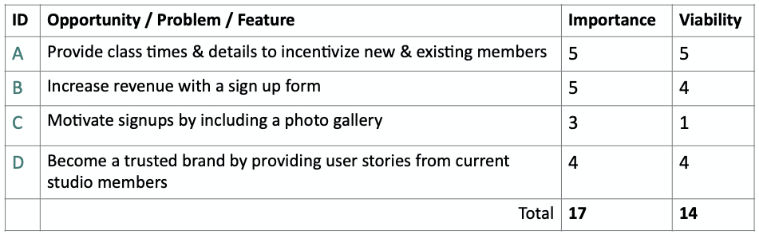
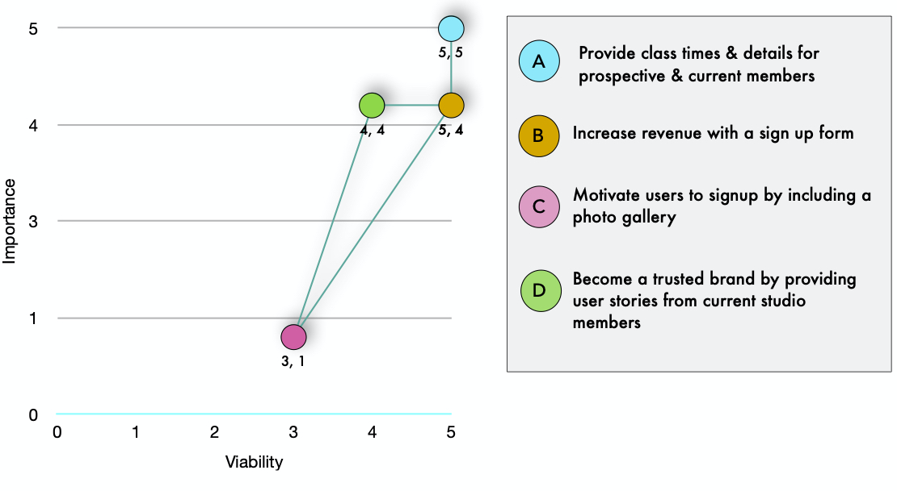

# Milestone 1

This responsive, user-friendly website was created for Infinity, a fictional yoga and meditation studio in New York, New York. As the Milestone 1 Project for [Code Institute's](https://codeinstitute.net) Full Stack Software Development Program, this website was built with HTML, CSS & Bootstrap.

Infinity’s website features an attractive Jumbotron image with a call-to-action button that, when clicked, directs users to the schedule. The schedule provides class details, times and an option to signup. The website also features an informative, 'About' section and 'Customer Reviews.'

## UX

This website was built for Infinity, a fictional yoga and meditation studio in Manhattan. The goal of the studio is to provide information and attract new & existing members. The target market for Infinty is men & women (ages 24-36) who live in New York, NY and currently practice or wish to begin practicing yoga and meditation.

The final version of this website allows Infinity to achieve its' goals for the following reasons:

* Infinity's website is responsive across all devices.

* The website navigation is intuitive.

* The website provides a call-to-action button with a link in the Jumbotron (above the fold).

* The website provides class details and class times in one central location.

* The website provides information about the studio and its' procedures.

User stories were created by the developer during the planning phase of this project and were used to help guide the wire framing process:

> As a user, I want a fixed navbar so I can navigate the page easily.
>>
> As a user, I want to fill out the 'Contact Form' in less than 3 clicks.
>>
> As a user, I can navigate back to the top of the page easily, so I don't have to spend time scrolling up.
>>
> As a user, I want the ‘About’ section to provide meaningful information.

In order to determine what features were the most important and most viable, the following Strategy Plane activity was completed during the planning phase of this project.

A full write-up of this exercise can also be viewed [here](assets/development/StrategyActivity.pdf).

Once the strategy exercises were completed, thhe following wireframes were created by the developer.

* [Desktop Wireframe](assets/development/desktopwireframe.jpeg)

* [Tablet Wireframe](assets/development/tabletwireframe.jpg)

* [Mobile Wireframe](assets/development/mobilewireframe.jpeg)

All wire-frames were created with [Balsamiq](https://balsamiq.com/) and can be viewed in [this document](assets/development/WireframesDoc.pdf).

## Features

* Schedule: The schedule section provides site visitors with class information and a place to sign up by listing class times, durations, descriptions and a, "Sign Up," button.

    *You can view the schedule [here](file:///Users/b3tafish/Documents/GitHub/MS-1/index.html#schedule).*

* Sign Up Form: The sign up form gives users an option to sign up for a class, by clicking on a button, filling out a form and submitting it.

* User stories: The user stories allow users to learn more about Infinity and its' procedures from relatable, trustworthy sources by viewing photos of and reading quotes from existing Infinity members.

* Contact Form: The contact form allows site visitors to contact the studio by filling out a form and inputting their name, email and comments.

### Existing Features

* Schedule
* Sign Up Form
* User Stories
* Contact Form

## Technologies Used

This project makes use of the following languages, frameworks and libraries:

* [HTML](https://html5tutorial.info)

* [CSS](https://www.w3.org/Style/CSS/Overview.en.html)

* [Bootstrap](https://getbootstrap.com)

## Testing

The following tests have been conducted by the [developer](https://www.github.com/alissatroiano). Each test described below was accompanied by the actions taken to ensure the tests passed. ***A full write-up of the testing process can also be reviewed [here](assets/development/Testing.pdf).***

1. Navigation:
    1. Visited navigation bar in website.
    2. Clicked each link.
    3. Verified links bring user to proper section.
    4. Repeated steps 1-3 on mobile and tablet.

2. Contact Form:
    1. Visited contact section of website.
    2. Filled out contact form with text.
    3. Tried to submit contact form with `required` field blank.
    4. Failed to fill out "email" without email address.
    5. Repeated steps 1-4 on mobile and tablet.

3. Sign Up Form:
    1. Visited website and clicked each, 'Sign Up' button.
    2. Filled out 3 sign up forms.
    3. Failed to submit forms before completing each row.
    4. Failed to submit 'email' rows without email address.
    5. Repeated steps 1-4 on tablet and mobile.

4. W3C Jigsaw CSS Test:
    1. Visited [W3C HTML Validator](https://validator.w3.org/nu/#textarea).
    2. Uploaded entire stylesheet.
    3. Made all changes.
    4. Ran test again to verify all CSS passed.
    5. Repeated steps 1-4 again after repairing styles.

5. W3C HTML Test:
    1. Visited [W3C HTML Validator](https://validator.w3.org/nu/#textarea).
    2. Pasted all contents of `index.html`.
    3. Made all corrections to repair errors.
    4. Ran test again to verify all HTML passed tests.
    5. Repeated steps 1-4 after each update.

Please see the enclosed [document](assets/development/Testing.pdf) to view the full Testing write-up for this project.

## Deployment

This project was deployed with [Github Pages](https://pages.github.com/). The [developer](https://github.com/alissatroiano) deployed the project successfully by following these steps:

1. Created a repository.
1. Opened project in GitHub Desktop and VSCode.
1. Created index.html.
1. Built project website.
1. Committed and pushed all changes to Github.
1. Once project was completed, visited "repository settings" on GitHub.com.
1. Scrolled down to the GitHub Pages section and clicked, "source".
1. Fired up a browser and went [here](https://alissatroiano.github.io/MS-1/) to ensure deployment was successful.

To run this project remotely:

1. Clone the repository using **git clone** open index.html in your web browser
1. **cd** project folder
1. **~/ms-1/setup-repo** then follow the instructions
1. **git push deploy**

To run this project locally, choose one of the following options:

1. **git init**
1. **git remote add deploy**
*then push to the server and deploy*
1. **git add .**
1. **git commit -m "commit message"**
1. **git push deploy master**

You can also:

* Download & unzip the project file, then open index.html in your web browser
*or*
* View a live version of this project [here](https://alissatroiano.github.io/MS-1/)

## Credits

### Content

Written Content:

* The class descriptions in the schedule section were copied from [Holistic Yoga School](https://www.holisticyogaschool.com/yoga-class-description/) and reworded by the [developer](https://www.github.com/alissatroiano).

* The deployment section of this README file was copied from [Medium](https://medium.com/@francoisromain/vps-deploy-with-git-fea605f1303b)

* All other website content pertaining to Infinity Studio is fictional and was written by the [developer](https://www.github.com/alissatroiano).

Code Resources:

* The template for the 404 Error page was copied from [Colorlib](https://colorlib.com/wp/free-404-error-page-templates/).

* I learned how to properly place the favicon by viewing [this video](https://www.youtube.com/watch?v=kEf1xSwX5D8).

* The deployment section of this README file was copied from [Medium](https://medium.com@francoisromain/vps-deploy-with-git-fea605f1303b).

* The markdown language used to write this README was inspired by [Github Guides](https://guides.github.com/features/mastering-markdown/).

* The tools used to repair any markdown issues were acquired from [this article](https://github.com/DavidAnson/markdownlint/blob/v0.20.2/doc/Rules.md#md004).

* The text decoration property used to style the navbar were aquired from [W3 Schools](https://www.w3schools.com/cssref/pr_text_text-decoration.asp).

Code Snippets:

* The syntax for the navigation was copied from [Bootstrap](https://getbootstrap.com/).

* The media queries in style.css were copied from [CSS Tricks](https://css-tricks.com/perfect-full-page-background-image/).

* The contact section was copied from [W3 Schools: The Company Tutorial](https://www.w3schools.com/bootstrap/bootstrap_theme_company.asp); the [developer](https://www.github.com/alissatroiano) then customized the columns, placement, sizes, colors and content.

* The serif font, 'Playfair Display' used for the headings in this project was imported from [Google Fonts](https://fonts.google.com/).

* The sans-serif font, 'Futura-PT' used for the body content was imported from [Adobe Fonts](https://fonts.adobe.com/fonts).

* The card layout/design used in the, "Quotes," section was copied from [Material Design for Bootstrap](https://mdbootstrap.com/).

* The syntax for the Jumbotron container background image was copied from [CSS Tricks](https://css-tricks.com/perfect-full-page-background-image/) and [Code Institute's](https://codeinstitute.net) Bootstrap project, 'Whiskey Drop'.

* The syntax for the social media icons in the navbar was copied from [codelab](https://www.tutorialrepublic.com/codelab.php?topic=bootstrap&file=elegant-navbar-with-social-media-icons) tutorial.

* The script used to overwrite Bootstrap's default navbar styles were copied from [Stack Overflow](https://stackoverflow.com/questions/36105119/bootstrap-change-navbar-active-background-color?answertab=active#tab-top) and [JSFiddle](https://jsfiddle.net/g2ys46qo/2/)

### Media

* The photo for "Vinyasa Flow" in the schedule section was copied from [Pexels](https://images.pexels.com/photos/3984340/pexels-photo-3984340.jpeg?auto=compress&cs=tinysrgb&dpr=2&h=750&w=1260).

* The photo for, 'Restorative Yoga' in the schedule section was copied from [Adobe Stock](https://stock.adobe.com/search?load_type=search&is_recent_search=&search_type=usertyped&k=restorative+yoga&native_visual_search=&similar_content_id=&asset_id=300959883).

* The photo for, 'Chakra Cleansing,' in the schedule section was copied from [Adobe Stock](https://stock.adobe.com/images/females-meditating-in-padmasana-at-yoga-class/194685469).

* The favicon was downloaded from [FreeSVG](https://freesvg.org/infinity-symbol-silhouette).

* The Jumbotron image was copied from [Unsplash](https://unsplash.com/photos/D2uK7elFBU4)

* All of the icons on Infinity’s website were imported from [Font Awesome](https://fontawesome.com/) and styled with the project's primary color.

* The photo of Octavia Bliss in the 'Quotes' section was copied from [Pexels](https://www.pexels.com/photo/woman-practicing-yoga-3822904/).

* The photo of Daniel Zen in the 'Quotes' section was copied from [Unsplash](https://unsplash.com/photos/hyfRxVq9OUk).

* The photo of Sara Solar in the 'Quotes' section was copied from [Pexels](https://www.pexels.com/photo/exercising-keeps-oneself-healthy-3768918/).

### Acknowledgements

Project:

* This project was created as the Milestone 1 Project for [Code Institute's](https://codeinstitute.net) User Centric Front End Development portion of the Full Stack Software Development program.

* I received inspiration from [Code Institute's](https://codeinstitute.net).

* I received inspiration from [Material Design for Bootstrap](https://mdbootstrap.com/).

* I received inspiration from [Awwwards](https://www.awwwards.com/).

* I received inspiration from [Mat Rebel](http://www.matrebel.co.uk/).
